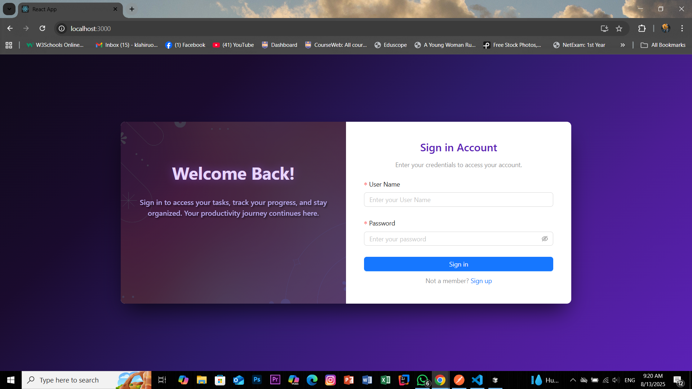
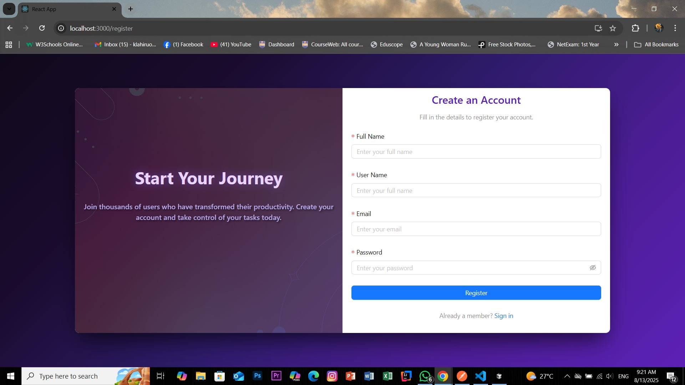
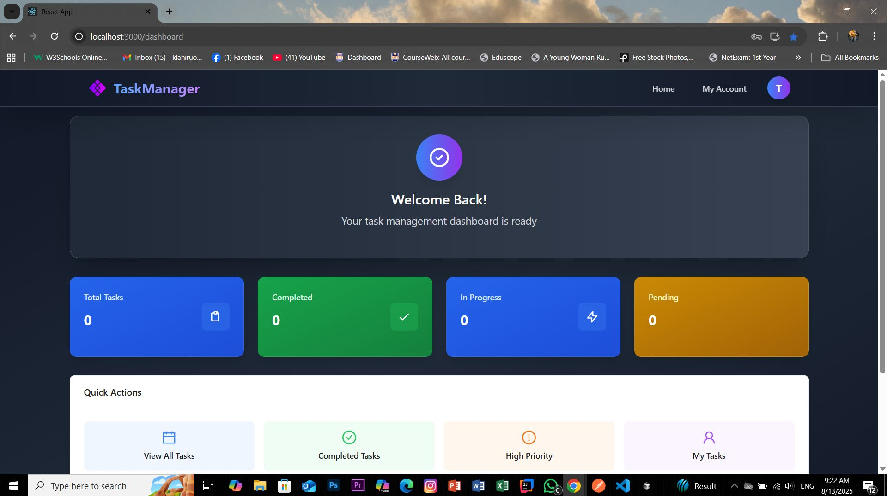
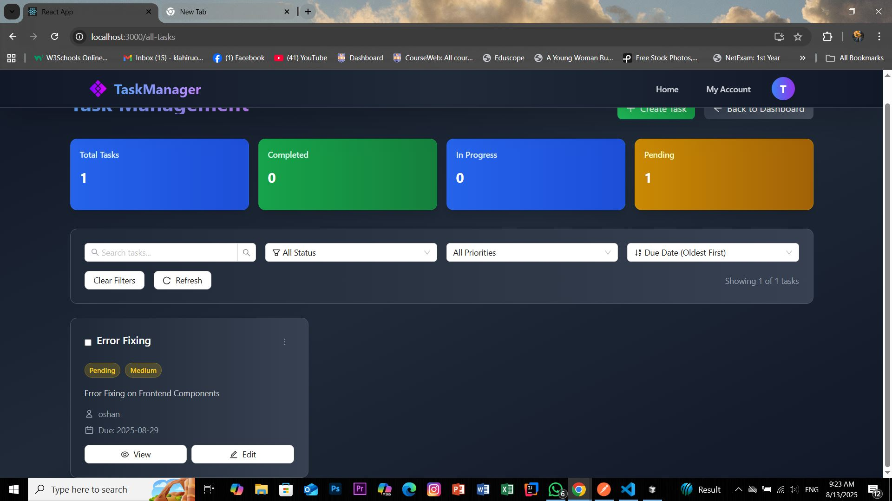

# 🚀 Task Management Application

A modern, full-stack task management application built with React and Spring Boot, featuring a beautiful dark violet theme and comprehensive task management capabilities.


## 📸 Screenshots

### Login Page


### Dashboard


### Task Management


### Task Creation Modal


## ✨ Features

- 🔐 **Secure Authentication** - JWT-based login/register system
- 📋 **Task Management** - Create, read, update, delete tasks
- 🎨 **Modern UI** - Beautiful dark violet theme with gradient backgrounds
- 📊 **Dashboard Analytics** - Visual task statistics and progress tracking
- 🔍 **Advanced Filtering** - Search, filter, and sort tasks by various criteria
- 📱 **Responsive Design** - Works perfectly on desktop and mobile devices
- ⚡ **Real-time Updates** - Instant UI updates without page refresh

## 🛠️ Technology Stack

### Frontend
- **React 19.1.1** - Modern JavaScript library for building user interfaces
- **Ant Design 5.24.6** - Enterprise-level UI design language and React UI library
- **Tailwind CSS 3.4.17** - Utility-first CSS framework for rapid UI development
- **Axios 1.11.0** - Promise-based HTTP client for API communication
- **React Router DOM 7.8.0** - Declarative routing for React applications

### Backend
- **Spring Boot 3.4.8** - Java-based framework for building web applications
- **Spring Security** - Authentication and authorization framework
- **Spring Data JPA** - Data access layer for database operations
- **MySQL 8.0** - Relational database management system
- **JWT (JSON Web Tokens)** - Stateless authentication mechanism
- **Lombok** - Reduces boilerplate code in Java
- **ModelMapper** - Object mapping library

### Development Tools
- **Maven** - Build automation and dependency management
- **Node.js & npm** - JavaScript runtime and package manager
- **PostCSS & Autoprefixer** - CSS processing tools

## 📋 Prerequisites

Before running this application, make sure you have the following installed:

- **Java 17** or higher
- **Node.js 16** or higher
- **MySQL 8.0** or higher
- **Maven 3.6** or higher
- **Git** (for cloning the repository)

## 🚀 Quick Start

### 1. Clone the Repository

```bash
git clone <your-repository-url>
cd task-management-app
```

### 2. Database Setup

1. **Install MySQL** if you haven't already
2. **Create a MySQL user** or use the root user
3. **Update database configuration** in `backend/demo/src/main/resources/application.properties`:

```properties
spring.datasource.username=your_username
spring.datasource.password=your_password
```

### 3. Backend Setup

```bash
# Navigate to backend directory
cd backend/demo

# Build the project
mvn clean install

# Run the Spring Boot application
mvn spring-boot:run
```

The backend will start on `http://localhost:5000`

### 4. Frontend Setup

```bash
# Open a new terminal and navigate to frontend directory
cd frontend

# Install dependencies
npm install

# Start the development server
npm start
```

The frontend will start on `http://localhost:3000`

### 5. Access the Application

- Open your browser and go to `http://localhost:3000`
- Register a new account or login with existing credentials
- Start managing your tasks!

## 🔧 Configuration

### Backend Configuration

The main configuration file is located at `backend/demo/src/main/resources/application.properties`:

```properties
# Server Configuration
server.port=5000
spring.application.name=demo

# Database Configuration
spring.jpa.hibernate.ddl-auto=update
spring.datasource.url=jdbc:mysql://localhost:3306/task_manager?createDatabaseIfNotExist=true
spring.datasource.username=root
spring.datasource.password=your_password
spring.datasource.driver-class-name=com.mysql.cj.jdbc.Driver
spring.jpa.show-sql=true

# JWT Configuration
jwt.secret=your_jwt_secret_key
jwt.expiration=3600000
```

### Frontend Configuration

The frontend API configuration is in the service files:

- **AuthService**: `frontend/src/Services/AuthService.js`
- **TaskService**: `frontend/src/Services/TaskServices.js`

Update the base URLs if needed:
```javascript
const base_uri = 'http://localhost:5000/auth'
const API_BASE_URL = 'http://localhost:5000/api/task'
```

## 📚 API Endpoints

### Authentication Endpoints

| Method | Endpoint | Description | Request Body |
|--------|----------|-------------|--------------|
| `POST` | `/auth/register` | Register a new user | `{ "name", "username", "email", "password" }` |
| `POST` | `/auth/login` | Login user | `{ "username", "password" }` |

### Task Management Endpoints

| Method | Endpoint | Description | Headers |
|--------|----------|-------------|---------|
| `GET` | `/api/task/getAll` | Get all tasks | `Authorization: Bearer <token>` |
| `GET` | `/api/task/getTaskById/{id}` | Get task by ID | `Authorization: Bearer <token>` |
| `GET` | `/api/task/getByUserName/{username}` | Get tasks by username | `Authorization: Bearer <token>` |
| `POST` | `/api/task/createTask` | Create new task | `Authorization: Bearer <token>` |
| `PUT` | `/api/task/update/{id}` | Update task | `Authorization: Bearer <token>` |
| `DELETE` | `/api/task/delete/{id}` | Delete task | `Authorization: Bearer <token>` |

### User Management Endpoints

| Method | Endpoint | Description | Headers |
|--------|----------|-------------|---------|
| `GET` | `/api/users/getAllUsers` | Get all users | `Authorization: Bearer <token>` |
| `GET` | `/api/users/user/{id}` | Get user by ID | `Authorization: Bearer <token>` |
| `DELETE` | `/api/users/{id}` | Delete user | `Authorization: Bearer <token>` |

### Request/Response Examples

#### Create Task
```json
POST /api/task/createTask
Authorization: Bearer <your_jwt_token>

{
  "taskName": "Complete Project Documentation",
  "description": "Write comprehensive documentation for the new feature",
  "status": "Pending",
  "priority": "High",
  "dueDate": "2024-01-15",
  "assignedTo": "john.doe",
  "userName": "john.doe"
}
```

#### Login Response
```json
{
  "token": "eyJhbGciOiJIUzI1NiIsInR5cCI6IkpXVCJ9...",
  "username": "john.doe",
  "email": "john.doe@example.com"
}
```

## 🏗️ Project Structure

```
task-management-app/
├── frontend/                          # React frontend application
│   ├── public/                        # Static files
│   ├── src/
│   │   ├── Components/                # Reusable React components
│   │   │   ├── CreateTaskModal.jsx
│   │   │   ├── EditTaskModal.jsx
│   │   │   ├── NavBar.jsx
│   │   │   ├── TaskAnalytics.jsx
│   │   │   ├── TaskDetailModal.jsx
│   │   │   └── TaskManager.jsx
│   │   ├── Pages/                     # Page components
│   │   │   ├── AllTasksPage.jsx
│   │   │   ├── Dashbord.jsx
│   │   │   ├── LoginPage.jsx
│   │   │   └── RegisterPage.jsx
│   │   ├── Services/                  # API service files
│   │   │   ├── AuthService.js
│   │   │   └── TaskServices.js
│   │   └── App.js                     # Main application component
│   ├── package.json                   # Frontend dependencies
│   └── tailwind.config.js            # Tailwind CSS configuration
├── backend/                           # Spring Boot backend application
│   └── demo/
│       ├── src/main/java/com/example/demo/
│       │   ├── Config/                # Configuration classes
│       │   │   ├── CorsConfig.java
│       │   │   ├── JwtAuthFilter.java
│       │   │   └── SecurityConfig.java
│       │   ├── Controllers/           # REST API controllers
│       │   │   ├── AuthController.java
│       │   │   ├── TaskController.java
│       │   │   └── UserController.java
│       │   ├── DTO/                   # Data Transfer Objects
│       │   │   ├── LoginRequest.java
│       │   │   ├── LoginResponse.java
│       │   │   ├── RegisterRequest.java
│       │   │   └── UserResponse.java
│       │   ├── Entities/              # JPA entities
│       │   │   ├── TaskEntity.java
│       │   │   └── UserEntity.java
│       │   ├── Repositories/          # Data access layer
│       │   │   ├── TaskRepository.java
│       │   │   └── UserRepository.java
│       │   ├── Services/              # Business logic layer
│       │   │   ├── JWTService.java
│       │   │   ├── TaskService.java
│       │   │   ├── UserDetailsServices.java
│       │   │   └── UserServices.java
│       │   └── DemoApplication.java   # Main application class
│       ├── src/main/resources/
│       │   └── application.properties # Application configuration
│       └── pom.xml                    # Maven dependencies
└── README.md                          # This file
```

## 🎨 UI Features

### Design System
- **Dark Violet Theme** - Modern gradient backgrounds with violet color scheme
- **Responsive Grid Layout** - Adaptive design for all screen sizes
- **Interactive Components** - Hover effects, animations, and smooth transitions
- **Loading States** - Visual feedback during API operations
- **Error Handling** - User-friendly error messages and notifications

### Key Components
- **Dashboard** - Overview with task statistics and quick actions
- **Task Manager** - Advanced filtering, sorting, and bulk operations
- **Modal Forms** - Clean and intuitive task creation/editing
- **Navigation** - Seamless routing between different sections

## 🔒 Security Features

- **JWT Authentication** - Secure token-based authentication
- **Password Encryption** - BCrypt password hashing
- **CORS Configuration** - Proper cross-origin resource sharing setup
- **Input Validation** - Server-side validation for all inputs
- **Protected Routes** - Authentication required for sensitive operations


## 🙏 Acknowledgments

- **Ant Design** for the beautiful UI components
- **Spring Boot** for the robust backend framework
- **Tailwind CSS** for the utility-first styling approach
- **JWT** for secure authentication implementation

